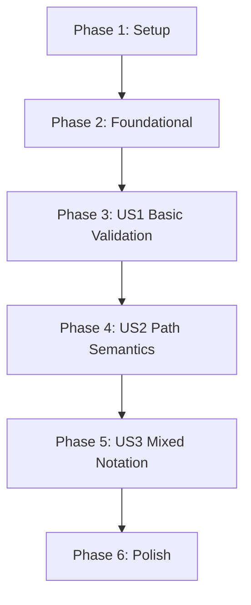

# Tasks: Pattern and Path Semantics

**Feature Branch**: `018-pattern-path-semantics`
**Status**: Ready
**Total Tasks**: 15

## Dependencies

## Phase 1: Setup

Goal: Initialize the feature branch and prepare the codebase for validation logic.

- [x] T001 Create project structure per implementation plan
  - Create `libs/gram/src/Gram/Validate.hs`
  - Create `libs/gram/tests/SemanticsSpec.hs`
  - Register new modules in `gram.cabal` if necessary (usually auto-detected or needs explicit add)
- [x] T002 Implement Checkpoint: Setup
  - **User Action**: `git add . && git commit -m "feat: setup validation module structure" && git push`
  - **Verification**: `cabal build` succeeds

## Phase 2: Foundational

Goal: Define the core data structures and types for validation.

- [x] T003 Define SymbolTable and Validation types in `libs/gram/src/Gram/Validate.hs`
  - Implement `SymbolTable`, `SymbolInfo`, `SymbolType`, `DefinitionStatus`, `PatternSignature`
  - Implement `ValidationEnv` and `ValidationError`
- [x] T004 Implement Checkpoint: Types
  - **User Action**: `git add . && git commit -m "feat: define validation types" && git push`

## Phase 3: US1 - Semantic Validation of Basic Patterns

Goal: Implement validation for single definitions, referential integrity, and self-references in basic pattern notation.

- [x] T005 [US1] Create basic pattern validation tests in `libs/gram/tests/SemanticsSpec.hs`
  - Test cases: Single definition `[a]`, Duplicate `[a][a]`, Undefined ref `[b|a]`, Self ref `[a|a]`
- [x] T006 [US1] Implement basic pattern traversal in `libs/gram/src/Gram/Validate.hs`
  - Implement `validatePattern` and helper functions to traverse `AnnotatedPattern`, `PatternElement`, `SubjectPattern`
- [x] T007 [US1] Implement Single Definition Rule logic
  - Update symbol table on definition, check for duplicates
- [x] T008 [US1] Implement Referential Integrity and Self-Reference checks
  - Track usage vs definition
  - Detect cycles in `SubjectPattern` traversal
- [x] T009 [US1] Implement Checkpoint: Basic Validation
  - **User Action**: `git add . && git commit -m "feat: implement basic pattern validation" && git push`
  - **Verification**: `cabal test` passes US1 tests

## Phase 4: US2 - Path Notation Semantics

Goal: Extend validation to support path notation, enforcing first-appearance definition and consistency.

- [x] T010 [US2] Add path validation tests in `libs/gram/tests/SemanticsSpec.hs`
  - Test cases: Path def `(a)-[r]->(b)`, Path redef checks, Anonymous `(a)-[:knows]->(b)`
- [x] T011 [US2] Implement path traversal and definition logic in `libs/gram/src/Gram/Validate.hs`
  - Handle `Path`, `PathSegment`, `Node`, `Relationship`
  - Decompose paths into equivalent pattern definitions in the Symbol Table
  - Enforce consistency (e.g., same endpoints for identified relationships)
- [x] T012 [US2] Implement Checkpoint: Path Validation
  - **User Action**: `git add . && git commit -m "feat: implement path notation validation" && git push`
  - **Verification**: `cabal test` passes US2 tests

## Phase 5: US3 - Mixed Notation Consistency

Goal: Ensure consistency between mixed pattern and path notations.

- [x] T013 [US3] Add mixed notation tests in `libs/gram/tests/SemanticsSpec.hs`
  - Test cases: Consistent `[r|a,b]` and `(a)-[r]->(b)`, Inconsistent structure/labels
- [x] T014 [US3] Implement cross-notation consistency checks in `libs/gram/src/Gram/Validate.hs`
  - Verify that path usage of an identifier matches its pattern definition (structure, arity)
  - Enforce immutability (cannot extend pattern definition via path)
- [x] T015 [US3] Implement Checkpoint: Full Validation
  - **User Action**: `git add . && git commit -m "feat: implement mixed notation validation" && git push`
  - **Verification**: All semantic tests pass

## Phase 6: Polish

Goal: Clean up, document, and integrate.

- [x] T016 Update module exports in `libs/gram/src/Gram.hs`
  - Export `validate` from `Gram.Validate`
- [x] T017 Update documentation in `design/SEMANTICS.md` (if needed based on implementation findings)
- [x] T018 Implement Checkpoint: Final Polish
  - **User Action**: `git add . && git commit -m "feat: polish validation and docs" && git push`
